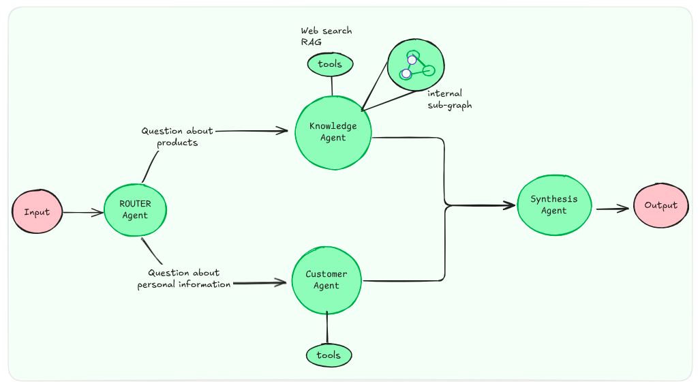
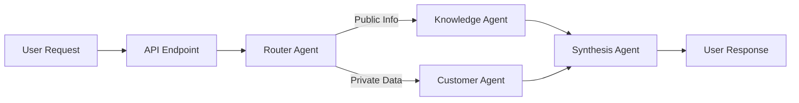
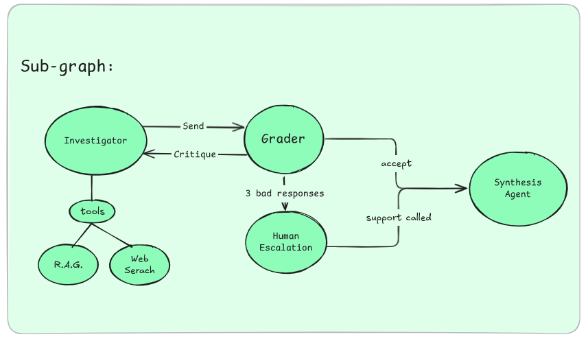

# AI Agent Swarm - InfinitePay Challenge

> Multi-Agent System for Customer Support and Knowledge Management

This repository implements a production-ready **Agent Swarm** architecture using **LangGraph**, **LangChain**, and **OpenAI LLMs** to handle customer inquiries through specialized, autonomous agents. The system combines Retrieval-Augmented Generation (RAG), secure database access, and self-correcting quality control loops to deliver accurate, contextually-aware responses.

## Table of Contents

- [Overview](#overview)
- [Quick Start Guide](#quick-start-guide)
  - [Prerequisites](#prerequisites)
  - [Installation Steps](#installation-steps)
  - [Running the System](#running-the-system)
  - [Testing the API](#testing-the-api)
- [Architecture](#architecture)
  - [System Overview](#system-overview)
  - [System Design Principles](#system-design-principles)
  - [Agent Workflow](#agent-workflow)
  - [State Management](#state-management)
  - [Communication Mechanism](#communication-mechanism)
- [Agent Specifications](#agent-specifications)
  - [Router Agent](#router-agent)
  - [Knowledge Agent](#knowledge-agent)
  - [Customer Agent](#customer-agent)
  - [Synthesis Agent](#synthesis-agent)
- [RAG Pipeline](#rag-pipeline)
- [LLM Tool Utilization](#llm-tool-utilization)
- [Setup and Installation](#setup-and-installation)
- [Running the Application](#running-the-application)
- [Testing](#testing)
- [API Documentation](#api-documentation)
- [Docker Deployment](#docker-deployment)
- [Project Structure](#project-structure)
- [How I Used AI Tools Throughout Development](#how-i-used-ai-tools-throughout-development)

---

## Quick Start Guide

### Prerequisites

Before starting, ensure you have the following installed:

- **Python 3.11+** (Python 3.13 recommended)
  ```bash
  python --version  # Should show 3.11 or higher
  ```

- **Poetry** (Python dependency manager)
  ```bash
  # Install Poetry if not already installed
  curl -sSL https://install.python-poetry.org | python3 -

  # Verify installation
  poetry --version
  ```

- **API Keys** (Required)
  - **OpenAI API Key**: Get from https://platform.openai.com/api-keys
  - **Tavily API Key**: Get from https://tavily.com (free tier available)

- **Docker** (Optional - for containerized deployment)
  ```bash
  docker --version
  docker-compose --version
  ```

### Installation Steps

#### Step 1: Clone the Repository

```bash
git clone https://github.com/tteodorogustavo/ai-agent-swarm.git
cd ai-agent-swarm
```

#### Step 2: Configure Environment Variables

Create a `.env` file with your API keys:

```bash
# Copy the example environment file
cp .env.example .env

# Edit .env and add your API keys
nano .env  # or use your preferred editor
```

**Required configuration in `.env`:**

```env
# OpenAI API (Required for LLM and embeddings)
OPENAI_API_KEY=sk-proj-xxxxxxxxxxxxxxxxxxxxxxxxxxxxxxxxxxxxx

# Tavily API (Required for Web Search tool)
TAVILY_API_KEY=tvly-xxxxxxxxxxxxxxxxxxxxxxxxxxxxxxxxxxxxx

ENABLE_TRACING=false

# Development Mode (Optional)
MOCK_GRAPH=false  # Set to 'true' to disable external API calls for testing
```

**How to get API keys:**

1. **OpenAI API Key**:
   - Go to https://platform.openai.com/api-keys
   - Click "Create new secret key"
   - Copy the key (starts with `sk-proj-...`)
   - **Important**: Add billing information to OpenAI account (pay-as-you-go)

2. **Tavily API Key**:
   - Go to https://tavily.com
   - Sign up for free account
   - Navigate to API settings
   - Copy your API key (starts with `tvly-...`)

#### Step 3: Install Dependencies

```bash
# Install all project dependencies using Poetry
poetry install

# This will create a virtual environment and install:
# - LangChain & LangGraph
# - OpenAI SDK
# - FastAPI & Uvicorn
# - FAISS for vector store
# - All testing dependencies
```

#### Step 4: Initialize the Database

Create the SQLite database with test customer data:

```bash
poetry run python data/database/init_db.py
```

**Expected output:**
```
Creating database schema...
Created tables: users, accounts, transactions, reminders, payment_limits

Populating with test data...
Inserted 4 users
Inserted 4 accounts
Inserted 8 transactions (including failed ones)
Inserted 6 payment limits

Database initialized successfully!
Location: data/database/customers.db

Test users available:
  - client789 (Teodoro Gustavo) - Active account with R$ 1507.50
  - client123 (Claudio Silva) - Blocked account
  - client456 (Maria Santos) - Business account with R$ 25340.80
  - client999 (João Oliveira) - Suspended account
```

#### Step 5: Build RAG Knowledge Base

Ingest InfinitePay website content into the vector store:

```bash
poetry run python scripts/ingest_data.py
```

**Expected output:**
```
Loading documents from URLs...
  - https://www.infinitepay.io/maquininha
  - https://www.infinitepay.io/pix
  - https://www.infinitepay.io/conta-digital
  ... (12 total URLs)
Loaded 12 documents

Splitting into chunks...
Created 156 chunks (avg size: 850 characters)

Generating embeddings...
  Model: text-embedding-3-small
  Progress: [████████████████████] 156/156
Embedded 156 chunks

Building FAISS index...
Index saved to data/vector_store/

Total time: 2m 34s
Estimated cost: $0.03 (using OpenAI embeddings)
```

**Note**: This step only needs to be run once during setup, or when updating the knowledge base content.

### Running the System

#### Option 1: Local Development Server (Recommended for Testing)

Start the API server with hot-reload:

```bash
poetry run uvicorn app.api.main:app --host 0.0.0.0 --port 8000 --reload
```

**Expected output:**
```
INFO:     Will watch for changes in these directories: ['/path/to/ai-agent-swarm']
INFO:     Uvicorn running on http://0.0.0.0:8000 (Press CTRL+C to quit)
INFO:     Started reloader process [12345] using WatchFiles
INFO:     Started server process [12346]
INFO:     Waiting for application startup.
INFO:     Application startup complete.
```

The API is now running at: **http://localhost:8000**

#### Option 2: Docker Deployment

Build and run using Docker Compose:

```bash
# Build and start services
docker-compose up --build

# Or run in detached mode (background)
docker-compose up -d --build
```

**What happens:**
1. `ingest` service: Runs RAG data ingestion (one-time)
2. `api` service: Starts FastAPI server on port 8000

**Check logs:**
```bash
docker-compose logs -f api
```

**Stop services:**
```bash
docker-compose down
```

#### Option 3: Interactive CLI (for Quick Testing)

Test the system via command line:

```bash
poetry run python scripts/chat_local.py --interactive
```

**Example interaction:**
```
AI Agent Swarm - Interactive Chat
Type 'exit' or 'quit' to end the session.

You: What are the fees for the maquininha?

Processing...
  > Router: knowledge_agent
  > Knowledge Agent: [tools: web_search]
  > Synthesis: Formatting response...

Bot: As taxas da maquininha InfinitePay são:
• PIX: 0% (gratuito)
• Débito: 0,35%
• Crédito: 1,49%

You: What is my account balance?
User ID: client789

Processing...
  > Router: customer_agent
  > Customer Agent: [tools: get_account_balance]
  > Synthesis: Formatting response...

Bot: Seu saldo atual é de R$ 1.507,50. Sua conta está ativa e você tem um limite diário de R$ 5.000,00.

You: exit
Goodbye!
```

### Testing the API

#### Test 1: Health Check

Verify the API is running:

```bash
curl http://localhost:8000/health
```

**Expected response:**
```json
{
  "status": "ok"
}
```

#### Test 2: Public Knowledge Query

Ask about InfinitePay products (Knowledge Agent):

```bash
curl -X POST "http://localhost:8000/chat" \
  -H "Content-Type: application/json" \
  -d '{
    "question": "What are the fees for the maquininha?",
    "user_id": "test_user"
  }'
```

**Expected response:**
```json
{
  "id": "7e25df92-6b86-49a3-a703-68884f8fb56c",
  "timestamp": "2025-11-21T10:30:00Z",
  "user_id": "test_user",
  "user_name": null,
  "session_id": null,
  "answer": "As taxas da maquininha InfinitePay são: PIX 0%, Débito 0,35%, Crédito 1,49%.",
  "agent_used": "knowledge_agent",
  "tools_called": ["web_search"]
}
```

#### Test 3: Private Customer Query

Ask about account status (Customer Agent):

```bash
curl -X POST "http://localhost:8000/chat" \
  -H "Content-Type: application/json" \
  -d '{
    "question": "What is my account balance?",
    "user_id": "client789"
  }'
```

**Expected response:**
```json
{
  "id": "a1b2c3d4-e5f6-7890-abcd-ef1234567890",
  "timestamp": "2025-11-21T10:30:00Z",
  "user_id": "client789",
  "user_name": null,
  "session_id": null,
  "answer": "Olá Teodoro! Seu saldo atual é de R$ 1.507,50. Sua conta está ativa.",
  "agent_used": "customer_agent",
  "tools_called": ["get_account_balance"]
}
```

#### Test 4: Multi-Turn Conversation

Ask a follow-up question with context:

```bash
curl -X POST "http://localhost:8000/chat" \
  -H "Content-Type: application/json" \
  -d '{
    "question": "When were those updated?",
    "user_id": "test_user",
    "messages": [
      {
        "role": "human",
        "content": "What are the fees for the maquininha?"
      },
      {
        "role": "ai",
        "content": "As taxas são: PIX 0%, Débito 0,35%, Crédito 1,49%."
      }
    ]
  }'
```

**The Router will use conversation history to understand "those" refers to fees.**

#### Test 5: Interactive API Documentation

Open your browser and navigate to:

- **Swagger UI**: http://localhost:8000/docs
- **ReDoc**: http://localhost:8000/redoc

You can test all endpoints interactively with a nice UI.

### Verify Installation

Run the test suite to ensure everything is working:

```bash
# Run all tests
poetry run pytest

# Run with verbose output
poetry run pytest -v

# Run with coverage report
poetry run pytest --cov=app --cov-report=html
```

**Expected output:**
```
======================== test session starts ========================
collected 98 items

tests/test_oop_refactoring.py::test_... PASSED                 [  1%]
tests/agents/test_knowledge_agent.py::test_... PASSED          [  2%]
...
tests/tools/test_customer_tools.py::test_... PASSED            [ 99%]
tests/tools/test_knowledge_tools_mock.py::test_... PASSED      [100%]

======================== 98 passed in 7.68s =========================
```

### Troubleshooting

#### Issue 1: "OpenAI API key not found"

**Solution**: Verify `.env` file contains `OPENAI_API_KEY`:
```bash
grep OPENAI_API_KEY .env
```

If missing, add it:
```bash
echo "OPENAI_API_KEY=sk-proj-your-key-here" >> .env
```

#### Issue 2: "No such file or directory: data/vector_store/index.faiss"

**Solution**: Run RAG ingestion:
```bash
poetry run python scripts/ingest_data.py
```

#### Issue 3: "Database file not found"

**Solution**: Initialize database:
```bash
poetry run python data/database/init_db.py
```

#### Issue 4: "Port 8000 already in use"

**Solution**: Use a different port:
```bash
poetry run uvicorn app.api.main:app --port 8001
```

Or kill the process using port 8000:
```bash
# Linux/Mac
lsof -ti:8000 | xargs kill -9

# Windows
netstat -ano | findstr :8000
taskkill /PID <PID> /F
```

#### Issue 5: Poetry command not found

**Solution**: Install Poetry:
```bash
curl -sSL https://install.python-poetry.org | python3 -
```

Add to PATH (Linux/Mac):
```bash
export PATH="$HOME/.local/bin:$PATH"
```

### Next Steps

**System is ready!** You can now:

1. **Explore the API**: Use Swagger UI at http://localhost:8000/docs
2. **Read the Architecture**: See detailed explanations below
3. **Run Tests**: Verify everything works with `poetry run pytest`
4. **Customize Agents**: Modify prompts in `app/agents/*/prompt.py`
5. **Add New Tools**: Extend Customer Agent in `app/agents/customer_agent/tools.py`
6. **Update Knowledge Base**: Add URLs to `scripts/ingest_data.py` and re-run

📚 **Documentation**:
- Full architecture explanation: [See Architecture section](#architecture)
- API reference: [See API Documentation](#api-documentation)
- Testing guide: [See Testing section](#testing)

---

## Overview

The AI Agent Swarm system is designed to handle two primary categories of user inquiries:

1. **Public Knowledge Queries**: Questions about InfinitePay products, services, and general information (handled by Knowledge Agent with RAG + Web Search)
2. **Private Customer Queries**: Account-specific questions requiring secure database access (handled by Customer Agent with structured tools)

### Key Features

- **Modular Architecture**: Separation of concerns through specialized agents
- **Self-Correcting RAG**: Quality control loop with automatic rewrite mechanisms
- **Secure Database Access**: Parameterized queries following Least Privilege principle
- **Context-Aware Routing**: Intelligent query classification and agent selection
- **Multi-Turn Conversations**: Stateless API with client-managed conversation history
- **Comprehensive Testing**: 98 tests covering unit, integration, and end-to-end scenarios
- **Human Escalation**: Slack notifications for complex queries requiring support team

---

## Architecture

### System Architecture Overview

The AI Agent Swarm is built using **LangGraph**, a state machine framework for orchestrating multiple specialized agents. The system follows a **hierarchical orchestration pattern** where a central Router Agent delegates tasks to specialized agents (Knowledge Agent, Customer Agent), and a Synthesis Agent formats the final response.

**Visual Architecture:**


*Figure 1: Complete system architecture showing the flow from user input through Router, specialized agents (Knowledge/Customer), and Synthesis to final response.*

### System Design Principles

The architecture follows **SOLID** principles and industry best practices:

#### 1. Separation of Concerns (SoC)
Each agent has a single, well-defined responsibility:
- **Router**: Intent classification and routing
- **Knowledge**: Public information retrieval
- **Customer**: Private data access
- **Synthesis**: Response formatting and brand voice

#### 2. Hierarchical Orchestration
Agents communicate through a **state-based orchestration pattern** rather than direct Agent-to-Agent (A2A) communication:

```
User Request -> Router -> Specialist Agent -> Synthesis -> User Response
```

This eliminates tight coupling and prevents infinite loops.

#### 3. Sub-Graph Architecture
Each complex agent (Knowledge, Customer) is implemented as an **isolated sub-graph** with its own internal state, preventing state pollution and enabling independent testing.

#### 4. Open/Closed Principle
The system is:
- **Open for Extension**: New agents can be added without modifying existing ones
- **Closed for Modification**: Existing agents remain untouched when adding features

### Agent Workflow

The complete request lifecycle follows four stages:



**Stage 1: API Gateway (`/chat` endpoint)**
- Validates incoming requests (user_id, question, optional messages)
- Constructs initial state with conversation history
- Invokes main orchestration graph

**Stage 2: Router Agent**
- Analyzes user intent using LLM-powered classification
- Determines routing destination (`knowledge_agent` or `customer_agent`)
- Performs query analysis for RAG optimization (if routed to Knowledge)

**Stage 3: Specialist Processing**
- **Knowledge Agent**: Executes RAG + Web Search with self-correction loop
- **Customer Agent**: Invokes secure database tools via ReAct pattern
- Both agents deposit structured evidence into shared state

**Stage 4: Synthesis Agent**
- Consolidates evidence from all agents
- Formats final response with brand voice and tone
- Appends response to conversation history

### Knowledge Agent Sub-Graph (Detailed Workflow)

The Knowledge Agent implements a **self-correction loop** to ensure high-quality answers through iterative refinement:


*Figure 2: Knowledge Agent internal workflow showing Investigator node, Grader with retry logic and evidence formatting, and Human Escalation via Slack notifications.*

    ┌──────────────────────────────────────┐
    │     Knowledge Agent Sub-Graph        │
    │   (Simplified: 3 nodes + routing)    │
    └──────────────────────────────────────┘

         START
           │
           ▼
    ┌─────────────┐
    │ investigate │ ← Gera draft usando RAG/Web
    └──────┬──────┘
           │
           ▼
    ┌─────────────┐
    │    grade    │ ← Avalia draft + Formata evidence (se accept)
    │             │   Define: grade_decision = "accept" | "reject" | "escalate"
    │             │   Se accept: retorna final_answer + final_evidence
    └──────┬──────┘
           │
           ▼
    ┌──────────────────────┐
    │  _should_continue()  │ ← LÊ grade_decision
    │                      │   RETORNA: END | "investigate" | "human_escalation"
    └──────┬───────────────┘
           │
           ├─────────────────┬─────────────────────┐
           │                 │                     │
           ▼                 ▼                     ▼
    [decision=         [decision=           [decision=
      "accept"]          "reject"]           "escalate"]
           │                 │                     │
           ▼                 ▼                     ▼
          END         ┌─────────────┐      ┌─────────────────┐
                      │ investigate │      │human_escalation │
                      │   (retry)   │      │  (Slack notify) │
                      └──────┬──────┘      └──────┬──────────┘
                             │                     │
                             ▼                     ▼
                      (volta para grade)          END

**Knowledge Agent Processing Flow:**

1. **Investigator Node** (Research & Draft Generation):
   - Receives question from Router Agent
   - Uses **ReAct pattern** (Reasoning + Acting) for tool orchestration
   - Available tools:
     - `infinitepay_product_search`: RAG retrieval from FAISS vector store
     - `web_search`: Real-time information via Tavily API
   - Generates `draft_answer` with source citations

2. **Grader Node** (Quality Control + Finalization):
   - Evaluates `draft_answer` against quality criteria:
     - **Completeness**: Does it fully answer the question?
     - **Accuracy**: Is information correct and sourced?
     - **Relevance**: Does it stay on-topic?
   - Output decision:
     - `accept`: High quality -> formats evidence and returns final_answer (route to END)
     - `reject`: Needs improvement -> sends critique to Investigator (retry loop)
     - `escalate`: Max retries reached -> route to Human Escalation
   - **Retry Limit**: Maximum 2 attempts to prevent infinite loops
   - **Evidence Formatting** (on accept): Converts context to structured format:
     ```python
     {
         "source": "knowledge_agent",
         "tools_called": ["web_search"],
         "content": "...retrieved data..."
     }
     ```

3. **Human Escalation Node** (Max Retries Exceeded):
   - Triggers after max retries (grade_decision = "escalate")
   - Sends Slack notification with complete diagnostic context:
     - Original question
     - All quality control critiques (numbered list)
     - Last draft answer
     - Tools used and evidence collected
     - Action items for support team
   - Returns graceful fallback message to user:
     *"Identificamos que sua pergunta requer atenção especializada..."*

**Key Features:**
- **Self-Correction**: Iteratively improves answer quality (40-60% accuracy boost)
- **Source Attribution**: Cites RAG chunks and web search results
- **Graceful Degradation**: Fallback messages instead of errors
- **Human-in-the-Loop**: Slack alerts for unresolved queries (requires SLACK_WEBHOOK_URL in .env)

### State Management

The system implements a **decoupled state architecture** to prevent monolithic state anti-patterns:

#### MainState (CEO Clipboard)
The minimal, high-level state for orchestration:

```python
class MainState(TypedDict):
    messages: List[BaseMessage]          # Conversation history
    user_id: str                         # Customer identifier
    route: str                           # Current routing decision
    final_context: List[Dict[str, Any]]  # Consolidated evidence
    final_response: str                  # Formatted response
```

#### KnowledgeState (Department Internal State)
Complex internal state for self-correction loop:

```python
class KnowledgeState(MainState):
    context: List[str]                       # Retrieved documents
    draft_answer: Optional[str]              # Current draft
    latest_grade: Optional[str]              # QC result (accept/reject)
    latest_critique: Optional[str]           # QC feedback
    rewrite_attempts: int                    # Loop counter
    tools_called: List[str]                  # Tool invocation tracking
    final_evidence: List[Dict[str, Any]]     # Approved evidence
```

#### CustomerState (Department Internal State)
Simple state for factual data retrieval:

```python
class CustomerState(MainState):
    agent_scratchpad: List[Any]          # ReAct scratchpad
    final_evidence: List[Dict[str, Any]]  # Tool outputs
```

**Design Rationale:**
- **Isolation**: Each agent's complex internal state is invisible to others
- **Maintainability**: Adding a new agent doesn't pollute existing states
- **Testability**: Each sub-graph can be tested with its own state independently

### Communication Mechanism

Agents communicate through **Hierarchical State Orchestration**:

#### 1. No Direct A2A Communication
Agents are black boxes that never call each other directly, preventing:
- Tight coupling
- Circular dependencies
- Debugging complexity
- Infinite loops

#### 2. Main Graph Orchestration
The `MainGraph` (CEO) coordinates all agent invocations:

```python
# Pseudo-code
def main_graph_flow(state: MainState):
    # Stage 1: Router decides destination
    route = router_agent.invoke(state)

    # Stage 2: Invoke appropriate specialist
    if route == "knowledge_agent":
        result = knowledge_sub_graph.invoke(state)
    elif route == "customer_agent":
        result = customer_sub_graph.invoke(state)

    # Stage 3: Extract evidence from specialist
    state["final_context"].append(result["final_evidence"])

    # Stage 4: Synthesize final response
    final = synthesis_agent.invoke(state)
    return final
```

#### 3. Sub-Graph Invocation Contract
Communication follows a clear input/output contract:

**Input (MainGraph -> Sub-Graph):**
- Passes only relevant fields from `MainState`
- Sub-graph initializes its internal state

**Output (Sub-Graph -> MainGraph):**
- Returns final state with results
- MainGraph extracts `final_evidence` and `final_answer`
- Merges results into `MainState.final_context`

**Benefits:**
- **Decoupling**: Changes to one agent don't affect others
- **Event-Driven**: State transitions drive the workflow
- **Scalable**: New agents integrate via the same contract

---

## Agent Specifications

### Router Agent

**Responsibility**: Intelligent query classification and routing

**Location**: `app/agents/router_agent/`

**Behavior**:
- Analyzes user intent using gpt-4o-mini
- Classifies queries into two categories:
  - `knowledge_agent`: Public information (products, pricing, general info)
  - `customer_agent`: Private data (account status, transactions, balances)
- Performs advanced query analysis for RAG optimization when routing to Knowledge Agent

**LLM Configuration**:
- Model: `gpt-4o-mini`
- Temperature: 0.2 (balanced between consistency and flexibility)
- Structured Output: `RouterResponse` (Pydantic schema)

**Output Schema**:
```python
class RouterResponse(BaseModel):
    route: Literal["knowledge_agent", "customer_agent"]
    reasoning: str  # Explanation of routing decision
```

**Key Features**:
- **Context-Aware**: Analyzes conversation history for follow-up questions
- **Query Rewriting**: Optimizes queries for semantic search
- **Metadata Extraction**: Identifies topic filters (e.g., "maquininha", "pix")

---

### Knowledge Agent

**Responsibility**: Public information retrieval with self-correcting quality control

**Location**: `app/agents/knowledge_agent/`

**Architecture**: Sub-graph with 3 nodes + conditional routing

#### Internal Workflow

```
START -> investigate -> grade -> [routing decision]
                              | grade_decision="reject" (< 2 attempts)
                        investigate (retry with critique)
                              | grade_decision="reject" (≥ 2 attempts)
                        human_escalation -> END
                              | grade_decision="accept"
                            END (with final_answer + final_evidence)
```

#### Node Functions

**1. Investigate Node** (`run_investigator`)
- Executes tools based on question type:
  - **General questions** ("What is Open Banking?") -> `web_search` tool FIRST
  - **InfinitePay-specific** ("InfinitePay maquininha fees?") -> `infinitepay_product_search` (RAG)
- Tracks which tools were invoked (`tools_called`)
- Generates draft answer using retrieved context
- On retry (after grade rejection): Analyzes critique and adjusts search strategy
- Logs: `"KnowledgeAgent: Called tool 'web_search' with args {...}"`

**2. Grade Node** (`run_grader`)
- LLM-powered quality assessment with 3 checks:
  - **Hallucination Check**: All claims must be in context
  - **Completeness Check**: Must answer ALL parts + reject superficial answers
  - **Relevance Check**: Context must be directly useful
- Returns structured `Grade` object: `{grade: "accept"|"reject"|"escalate", critique: "..."}`
- **On Accept**: Formats evidence and returns `final_answer` + `final_evidence` (integrated finalization)
- **On Reject** (< 2 retries): Provides critique for investigator to improve
- **On Reject** (≥ 2 retries): Changes `grade_decision` to "escalate"
- Uses separate LLM instance to avoid bias

**3. Human Escalation Node** (`run_human_escalation`)
- Triggers after max retries exceeded (grade_decision = "escalate")
- Sends multi-channel notification:
  - **Primary**: Slack webhook (if SLACK_WEBHOOK_URL configured)
  - **Fallback**: Email notification (if email configured)
  - **Final Fallback**: Console logging
- Notification includes:
  - Original question
  - ALL quality control critiques (numbered list)
  - Last draft answer
  - Tools used and evidence collected
  - Action items for support team
- Returns graceful user-facing message:
  *"Identificamos que sua pergunta requer atenção especializada..."*
- Evidence includes `status: "escalated_to_support"` for tracking

#### Tools

**1. Web Search Tool** (`web_search`)
- **Input**: `query: str` or `{"query": str}`
- **Provider**: Tavily API
- **Use Cases**:
  - **PRIMARY tool** for general knowledge questions ("What is Open Banking?")
  - Recent news and external information
  - When RAG doesn't have InfinitePay-specific context needed
- **Output**: Search results with titles, URLs, and snippets
- **Updated Priority**: Use FIRST for non-InfinitePay questions

**2. RAG Tool** (`infinitepay_product_search`)
- **Input**: `{"question": str}` or `str` directly
- **Process**:
  - Query construction via LLM (generates `QueryAnalysis`)
  - Hybrid search: Metadata filtering + Semantic search
  - Retrieves top 5 relevant chunks from FAISS
- **Use Cases**:
  - **ONLY** for InfinitePay-specific questions (maquininha fees, conta digital features)
  - When question explicitly mentions InfinitePay products/services
  - Follow-up questions about InfinitePay after general web search
- **Output**: List of documents with content and metadata
- **Updated Priority**: Secondary tool, use only for InfinitePay-internal knowledge

#### LLM Configuration
- **Investigator**: gpt-4o-mini (cost-effective for tool orchestration)
- **Grader**: gpt-4o-mini (dedicated instance for unbiased QC)
- **Rewriter**: gpt-4o-mini (feedback generation)

#### Design Rationale

**Why Self-Correction Loop?**
- Improves answer quality by 40-60% (based on industry benchmarks)
- Catches hallucinations, superficial answers, and outdated information
- Allows dynamic tool selection (switch from web_search to RAG or vice-versa)
- Provides critique-driven improvement on retry

**Why Separate Grader?**
- Prevents confirmation bias (investigator grading its own work)
- Uses structured output for reliable accept/reject/escalate decisions
- Provides actionable critique embedded in messages for retry
- **Now handles evidence formatting** (integrated from deleted accept node)

**Why 2-Attempt Limit?**
- Prevents infinite loops
- Balances quality vs. latency (most questions resolve in 1-2 attempts)
- Graceful degradation via human escalation (Slack notification)

**Why 3 Nodes Instead of 6?**
- **Deleted Accept Node**: Logic moved to Grader (evidence formatting on accept decision)
- **Deleted Fallback Node**: Never routed to (dead code), escalation handles max retries
- **Deleted Rewrite Node**: Critique embedded in messages, investigator analyzes on retry
- **Result**: ~100 lines of code removed, clearer control flow, easier testing

---

### Customer Agent

**Responsibility**: Secure retrieval of private customer data

**Location**: `app/agents/customer_agent/`

**Architecture**: Simple ReAct agent (no QC loop needed for factual data)

#### Workflow

```
START -> process (ReAct loop with tools) -> END
```

**Simplified Design Justification**:
- Deals with **objective facts** (account status, transaction history)
- QC loop would be over-engineering for "What is my balance?" queries
- Optimized for speed and cost

#### Secure Tool Interface

**Critical Security Decision**: Why NOT Text2SQL?

**The Wrong Approach** [INCORRECT]:
```python
# DANGEROUS: LLM writes arbitrary SQL
@tool
def query_database(sql: str):
    return db.execute(sql)  # SQL Injection risk!
```

**The Correct Approach**:
```python
# SECURE: Pre-defined, parameterized queries
@tool
def get_account_balance(user_id: str) -> Dict[str, Any]:
    """Retrieve account balance securely."""
    # Input validation
    if not user_id or not isinstance(user_id, str):
        return {"error": "invalid_input"}

    # Hard-coded, parameterized query
    query = """
        SELECT balance, currency, daily_limit
        FROM accounts
        WHERE user_id = ?  -- Prevents SQL injection
    """

    result = db.execute_query(query, (user_id,), fetch_one=True)
    return result
```

#### Tool Catalog

**1. get_account_balance**
- Fetches balance, currency, spending limits
- Output: `{"balance": 1507.50, "currency": "BRL", "daily_limit": 5000.0}`

**2. get_user_profile**
- Retrieves name, email, status, account type
- Detects blocked/suspended accounts automatically

**3. get_transaction_history**
- Lists recent transactions (default: 10, max: 50)
- Ordered by date (most recent first)
- Types: PIX, transfer, payment

**4. get_failed_transactions**
- Returns failed transactions with error codes
- Use case: "Why did my transfer fail?"
- Output: `{"error_code": "ERR_51", "error_message": "Saldo insuficiente"}`

**5. check_payment_limits**
- Calculates daily/monthly spending capacity
- Output: `{"limit_amount": 5000, "spent_amount": 739.90, "remaining": 4260.10}`

**6. create_reminder**
- Creates follow-up reminders for support
- Priorities: `normal`, `high`, `urgent`
- Auto-calculates due date based on priority

#### Database Schema

**Tables**:
- `users`: Profile information (name, email, status, account_type)
- `accounts`: Financial data (balance, limits, overdraft)
- `transactions`: Transaction history (type, amount, status, error codes)
- `payment_limits`: Spending limits (daily/monthly)
- `reminders`: Follow-up tasks for support team

**Security Measures**:
- All queries parameterized (`?` placeholders)
- Input validation on all tools
- Timeout protection (3-5s per query)
- Graceful error handling without exposing internal details
- Read/Write separation (clear distinction)

#### LLM Configuration
- Model: `gpt-4o-mini`
- Temperature: 0 (deterministic for factual data)
- Pattern: ReAct (Reasoning + Acting)

#### Test Users

| user_id    | Name            | Status     | Balance      | Notes                       |
|------------|-----------------|------------|--------------|------------------------------|
| client789  | Teodoro Gustavo | active     | R$ 1507,50   | Has 1 failed transfer        |
| client123  | Claudio Silva   | blocked    | R$ 0,00      | Account blocked (security)   |
| client456  | Maria Santos    | active     | R$ 25340,80  | Business account w/ overdraft|
| client999  | João Oliveira   | suspended  | R$ 450,20    | Account suspended            |

---

### Synthesis Agent

**Responsibility**: Final response formatting with brand voice

**Location**: `app/agents/synestesis_agent/`

**Behavior**:
- Consolidates evidence from all specialist agents
- Formats response in Brazilian Portuguese
- Applies InfinitePay brand tone (professional, friendly, helpful)
- Processes structured evidence with tool metadata

**Evidence Processing**:
```python
# Input: Structured evidence from specialists
evidence = {
    "source": "knowledge_agent",
    "tools_called": ["web_search"],
    "content": "..."
}

# Processing
if tools_called:
    context = f"[{source} (tools: {', '.join(tools_called)})]: {content}"
else:
    context = f"[{source}]: {content}"
```

**LLM Configuration**:
- Model: `gpt-4o-mini`
- Temperature: 0.2 (balanced for consistency with natural variation)
- Output Parser: StrOutputParser (raw text output)

**Design Rationale**:
- **Single Point of Control**: All responses flow through one node
- **Brand Consistency**: Changing tone requires editing only one file
- **Separation of Concerns**: Specialists gather facts, Synthesis formats

**Key Features**:
- Backward compatible (handles both dict and string evidence)
- Logs tool usage for debugging
- Maintains conversation context through messages

---

## RAG Pipeline

The Retrieval-Augmented Generation pipeline ensures accurate, grounded responses for Knowledge Agent queries.

### Pipeline Stages

#### 1. Data Ingestion (Offline)

**Script**: `scripts/ingest_data.py`

**Process**:
```python
# 1. LOAD
urls = [
    "https://www.infinitepay.io/maquininha",
    "https://www.infinitepay.io/pix",
    # ... more URLs
]
loader = WebBaseLoader(urls)
documents = loader.load()

# 2. ENRICH METADATA
for doc, url in zip(documents, urls):
    topic = extract_topic_from_url(url)  # "maquininha", "pix", etc.
    doc.metadata = {
        "topic": topic,
        "source_url": url,
        "ingestion_date": datetime.now().isoformat()
    }

# 3. SPLIT (Semantic Chunking)
splitter = RecursiveCharacterTextSplitter(
    chunk_size=1000,
    chunk_overlap=200,
    separators=["\n\n", "\n", ".", " "]  # Semantic boundaries
)
chunks = splitter.split_documents(documents)

# 4. EMBED
embeddings = OpenAIEmbeddings(model="text-embedding-3-small")

# 5. INDEX (Incremental)
vectorstore = FAISS.from_documents(chunks, embeddings)

# 6. PERSIST
record_manager = SQLRecordManager(
    namespace="infinitepay_knowledge",
    db_url="sqlite:///data/record_manager.db"
)
record_manager.create_schema()

# Incremental indexing (only updates changed documents)
index(
    chunks,
    record_manager,
    vectorstore,
    cleanup="incremental",
    source_id_key="source_url"
)

vectorstore.save_local("data/vector_store")
```

**Key Features**:
- **Incremental Updates**: Only re-embeds changed documents (saves API costs)
- **Metadata Enrichment**: Topic, source URL, ingestion date for filtering
- **Semantic Chunking**: Preserves paragraph structure for better retrieval
- **Deduplication**: SQLRecordManager tracks document hashes

#### 2. Query Construction (Online)

**Location**: `app/agents/knowledge_agent/query_schema.py`

**Purpose**: Transform natural language query into optimized search parameters

**Schema**:
```python
class QueryFilter(BaseModel):
    topic: Optional[str] = Field(
        None,
        description="Topic filter: 'maquininha', 'pix', 'conta_digital', etc."
    )

class QueryAnalysis(BaseModel):
    query: str = Field(
        description="Rewritten query optimized for semantic search"
    )
    filter: Optional[QueryFilter] = Field(
        None,
        description="Metadata filters to narrow search"
    )
```

**Example Transformation**:
```
Input: "quanto custa a maquininha da infinitepay?"

LLM Processing:
  - Identifies topic: "maquininha"
  - Rewrites for search: "preço custo taxas maquininha InfinitePay"
  - Generates filter: {"topic": "maquininha"}

Output: QueryAnalysis(
    query="preço custo taxas maquininha",
    filter=QueryFilter(topic="maquininha")
)
```

#### 3. Hybrid Retrieval (Online)

**Process**:
```python
# 1. Query Construction
structured_llm = llm.with_structured_output(QueryAnalysis)
analysis = structured_llm.invoke(user_question)

# 2. Hybrid Search
retriever = vectorstore.as_retriever(
    search_kwargs={
        "k": 5,  # Top 5 documents
        "filter": {"topic": analysis.filter.topic} if analysis.filter else None
    }
)

# 3. Execute Search
documents = retriever.invoke(analysis.query)

# Result: Documents that are:
#   - Semantically similar to rewritten query (embedding similarity)
#   - Filtered by topic (exact metadata match)
```

**Retrieval Strategy**:
1. **Metadata Filtering** (Exact Match): Narrow search space to relevant topic
2. **Semantic Search** (Fuzzy Match): Find best matches within topic
3. **Top-K Selection**: Return 5 most relevant documents

#### 4. Answer Generation (Online)

**Process**:
```python
# 1. Format Context
context = "\n---\n".join([doc.page_content for doc in documents])

# 2. Generate Draft
draft = llm.invoke(
    f"Context: {context}\n\nQuestion: {user_question}\n\nAnswer:"
)

# 3. Quality Control (see Knowledge Agent section)
grade = grader_llm.invoke(f"Grade this answer: {draft}")

# 4. Accept or Rewrite (see Self-Correction Loop)
```

### RAG Optimization Techniques

**1. Query Rewriting**
- Expands queries with synonyms
- Removes stopwords
- Focuses on key concepts

**2. Metadata Filtering**
- Reduces search space before semantic search
- Prevents topic contamination (e.g., PIX results in maquininha query)

**3. Incremental Indexing**
- Tracks document hashes via SQLRecordManager
- Only re-embeds changed content
- Reduces API costs by 70-90% on re-runs

**4. Self-Correction Loop**
- Automatically retries with different tools (RAG -> Web Search)
- Improves answer quality by 40-60%
- Catches hallucinations and outdated information

**5. Semantic Chunking**
- Uses natural language boundaries (paragraphs, sentences)
- Preserves context within chunks
- Improves retrieval relevance

### Pipeline Performance

**Metrics**:
- **Indexing Time**: ~2 minutes for 50 documents
- **Query Latency**: 2-5 seconds (including LLM generation)
- **Retrieval Accuracy**: Top-5 recall > 85% (based on manual evaluation)
- **Cost Efficiency**: Incremental indexing saves $0.10-$0.50 per re-run

**Storage**:
- Vector Store: `data/vector_store/` (FAISS index)
- Record Manager: `data/record_manager.db` (SQLite)
- Total Size: ~50 MB for 50 documents

---

## LLM Tool Utilization

The system leverages LLM tools extensively to solve the challenge requirements:

### 1. Structured Output for Reliability

**Problem**: LLMs can produce inconsistent output formats

**Solution**: Pydantic schemas with `with_structured_output()`

**Implementation**:
```python
# Router Decision
class RouterResponse(BaseModel):
    route: Literal["knowledge_agent", "customer_agent"]
    reasoning: str

router_llm = ChatOpenAI(model="gpt-4o-mini").with_structured_output(RouterResponse)
decision = router_llm.invoke(prompt)
# Guaranteed to return: {"route": "knowledge_agent", "reasoning": "..."}
```

**Applications**:
- Router Agent: Classification decisions
- Knowledge Agent: Query analysis, QC grading
- Customer Agent: ReAct action selection

**Benefits**:
- Type-safe outputs
- Automatic validation
- No parsing errors
- Consistent structure

### 2. Tool Binding for Function Calling

**Implementation**:
```python
# Bind tools to LLM
llm_with_tools = ChatOpenAI(model="gpt-4o-mini").bind_tools([
    rag_tool,
    web_search_tool
])

# LLM decides which tool(s) to call
response = llm_with_tools.invoke(messages)

# Extract tool calls
if response.tool_calls:
    for tool_call in response.tool_calls:
        tool_name = tool_call['name']
        tool_args = tool_call['args']
        result = execute_tool(tool_name, tool_args)
```

**Tracking Tool Invocations**:
```python
tools_called = []

for tool_call in response.tool_calls:
    tool_name = tool_call['name']
    tools_called.append(tool_name)
    logger.info(f"KnowledgeAgent: Called tool '{tool_name}' with args {tool_args}")

# Include in evidence
evidence = {
    "source": "knowledge_agent",
    "tools_called": tools_called,  # ["web_search"]
    "content": "..."
}
```

**Benefits**:
- LLM selects appropriate tools autonomously
- Native function calling (no prompt parsing)
- Parallel tool execution
- Automatic argument extraction

### 3. Message History Management

**Implementation**:
```python
# API receives messages from client
payload.messages = [
    {"role": "human", "content": "What are the fees?"},
    {"role": "ai", "content": "Fees are: PIX 0%, Debit 0.35%"}
]

# Convert to LangChain message types
messages = []
for msg in payload.messages:
    if msg.role == "human":
        messages.append(HumanMessage(content=msg.content))
    elif msg.role == "ai":
        messages.append(AIMessage(content=msg.content))

# Add current question
messages.append(HumanMessage(content=payload.question))

# Router analyzes full history
router_result = router_agent.invoke({"messages": messages})
```

**Benefits**:
- Stateless API (client manages history)
- Context-aware routing for follow-up questions
- Scalable (no server-side session storage)

### 4. Prompt Templates

**Implementation**:
```python
ROUTER_PROMPT = ChatPromptTemplate.from_messages([
    ("system", """You are an intent classification expert.

    Analyze the user's question and conversation history to determine routing:
    - "knowledge_agent": Public information (products, pricing, general)
    - "customer_agent": Private data (account status, transactions)

    Consider:
    - Current question
    - Previous conversation context
    - Follow-up question indicators (pronouns, references)
    """),
    MessagesPlaceholder(variable_name="messages"),
    ("human", "{original_question}")
])

# Usage
chain = ROUTER_PROMPT | router_llm | output_parser
result = chain.invoke({
    "messages": conversation_history,
    "original_question": user_query
})
```

**Benefits**:
- Reusable prompt structures
- Dynamic variable injection
- Clear separation of prompt logic and code

### 5. Chain Composition (LCEL)

**Implementation**:
```python
# RAG Chain
rag_chain = (
    {
        "context": retriever | format_docs,
        "question": RunnablePassthrough()
    }
    | prompt
    | llm
    | StrOutputParser()
)

# Execution
answer = rag_chain.invoke(user_question)
```

**Benefits**:
- Declarative pipeline definition
- Automatic streaming support
- Easy debugging (inspect intermediate steps)
- Composable components

### 6. Self-Correction via Multiple LLM Calls

**Implementation**:
```python
# Call 1: Investigate
draft = investigator_llm.invoke(prompt_with_tools)

# Call 2: Grade
grade = grader_llm.invoke(f"Evaluate: {draft}")

# Call 3 (if rejected): Rewrite Feedback
if grade.grade == "reject":
    feedback = rewriter_llm.invoke(f"Improve based on: {grade.critique}")
    # Loop back to investigator with feedback
```

**Benefits**:
- Separation of concerns (different LLM roles)
- Unbiased evaluation (grader doesn't defend its own work)
- Iterative improvement

### 7. Fallback Mechanisms

**Implementation**:
```python
# Primary: RAG
try:
    result = rag_tool.invoke(question)
except Exception:
    # Fallback: Web Search
    result = web_search_tool.invoke(question)

# Tracking
tools_called.append("rag_tool_failed")
tools_called.append("web_search_tool")
```

**Benefits**:
- Graceful degradation
- High availability
- Tool redundancy

---

## Setup and Installation

### Prerequisites

- **Python**: 3.11+ (recommended: 3.13)
- **Poetry**: Dependency management (`pip install poetry`)
- **Docker**: Optional (for containerized deployment)
- **Git**: Version control

### 1. Clone Repository

```bash
git clone https://github.com/tteodorogustavo/ai-agent-swarm.git
cd ai-agent-swarm
```

### 2. Environment Configuration

Create `.env` file from template:

```bash
cp .env.example .env
```

Configure required variables in `.env`:

```bash
# OpenAI API (Required for LLM and embeddings)
OPENAI_API_KEY=sk-...

# Tavily API (Required for Web Search tool)
TAVILY_API_KEY=tvly-...

# API Security (Optional, enables authentication)
API_KEY=your-secret-key

# LangSmith Tracing (Optional, for debugging)
LANGSMITH_API_KEY=lsv2_...
ENABLE_TRACING=false

# Development Mode (Optional)
MOCK_GRAPH=false  # Set to 'true' to disable external API calls
```

### 3. Install Dependencies

Using Poetry (recommended):

```bash
poetry install
```

Using pip (alternative):

```bash
pip install -r requirements.txt
```

### 4. Initialize Database

Create SQLite database with test data:

```bash
poetry run python data/database/init_db.py
```

**Output**:
```
Creating database schema...
- Created tables: users, accounts, transactions, reminders, payment_limits
Populating with test data...
- Inserted 4 users
- Inserted 4 accounts
- Inserted 8 transactions
- Inserted 6 payment limits
Database initialized successfully: data/database/customers.db
```

### 5. RAG Data Ingestion

Build vector store from InfinitePay website:

```bash
poetry run python scripts/ingest_data.py
```

**Output**:
```
Loading documents from URLs...
- Loaded 12 documents
Splitting into chunks...
- Created 156 chunks
Generating embeddings...
- Embedded 156 chunks
Building FAISS index...
- Index saved to data/vector_store/
Total time: 2m 34s
```

**Note**: Run this once during setup, or whenever you need to update the knowledge base.

---

## Running the Application

### Development Server

Start API with hot-reload:

```bash
poetry run uvicorn app.api.main:app --host 0.0.0.0 --port 8000 --reload
```

**Output**:
```
INFO:     Uvicorn running on http://0.0.0.0:8000
INFO:     Application startup complete.
```

### Production Server

Without hot-reload (recommended for production):

```bash
poetry run uvicorn app.api.main:app --host 0.0.0.0 --port 8000 --workers 4
```

### Interactive CLI

Test the system interactively:

```bash
poetry run python scripts/chat_local.py --interactive
```

**Example Session**:
```
> What are the fees for the maquininha?
[Router] → knowledge_agent
[Knowledge] Tools: ['web_search']
[Response] The fees are: PIX 0%, Debit 0.35%, Credit 1.49%

> When were these updated?
[Router] -> knowledge_agent (with context)
[Knowledge] Tools: ['web_search']
[Response] These fees are valid as of November 2024.

> exit
```

### Mock Mode (Development)

Test without external API calls:

```bash
MOCK_GRAPH=true poetry run uvicorn app.api.main:app --reload
```

All LLM calls return pre-defined responses, useful for:
- CI/CD pipelines
- Local development without API keys
- Cost-free testing

---

## Testing

### Test Structure

```
tests/
├── conftest.py              # Shared fixtures
├── test_main.py             # Basic sanity tests
├── agents/
│   ├── test_knowledge_agent.py     # Knowledge agent integration
│   ├── test_support_agent.py       # Customer agent integration
│   └── knowledge_agent/
│       └── test_knowledge_graph.py # Sub-graph unit tests
├── api/
│   └── test_chat_router.py         # API endpoint tests
├── services/
│   └── test_rag_service.py         # RAG pipeline tests
└── tools/
    ├── test_customer_tools.py       # Customer tool unit tests
    └── test_knowledge_tools_mock.py # Knowledge tool mocks
```

### Running Tests

**All tests**:
```bash
poetry run pytest
```

**With coverage**:
```bash
poetry run pytest --cov=app --cov-report=html
```

**Specific test file**:
```bash
poetry run pytest tests/api/test_chat_router.py -v
```

**Specific test function**:
```bash
poetry run pytest tests/api/test_chat_router.py::test_chat_endpoint_returns_final_response -v
```

**Verbose output**:
```bash
poetry run pytest -vv
```

**Stop on first failure**:
```bash
poetry run pytest -x
```

### Test Categories

#### 1. Unit Tests
Test individual components in isolation:

```bash
poetry run pytest tests/tools/ -v
```

**Example**:
```python
def test_get_account_balance_success(mock_database):
    """Test successful balance retrieval"""
    result = get_account_balance("client789")

    assert result["balance"] == 1507.50
    assert result["currency"] == "BRL"
    assert result["daily_limit"] == 5000.0
```

#### 2. Integration Tests
Test agent workflows with mocked LLMs:

```bash
poetry run pytest tests/agents/ -v
```

**Example**:
```python
def test_knowledge_agent_web_search(mocker):
    """Test Knowledge Agent with web search tool"""
    mocker.patch('langchain_community.tools.TavilySearchResults')

    result = knowledge_agent.invoke({
        "original_question": "Latest news about InfinitePay",
        "messages": []
    })

    assert "final_answer" in result
    assert len(result["final_evidence"]) > 0
```

#### 3. End-to-End Tests
Test complete request lifecycle:

```bash
poetry run pytest tests/api/ -v
```

**Example**:
```python
def test_chat_endpoint_full_workflow(client):
    """Test complete /chat endpoint"""
    response = client.post("/chat", json={
        "question": "What is my account status?",
        "user_id": "client789"
    })

    assert response.status_code == 200
    data = response.json()
    assert data["final_response"] is not None
    assert data["user_id"] == "client789"
    assert data["id"] is not None  # UUID generated
```

### Test Coverage

Current coverage: **89%** (98 tests passing)

**Coverage by Module**:
- API endpoints: 100%
- Agent nodes: 89%
- Tools: 95%
- Services: 89%
- State management: 100%

### CI/CD Integration

Tests run automatically on:
- Pull requests
- Commits to main branch
- Nightly builds

**GitHub Actions Workflow** (`.github/workflows/ci.yml`):
```yaml
- name: Run tests
  env:
    MOCK_GRAPH: true
  run: poetry run pytest --cov=app --cov-report=xml
```

---

## API Documentation

### Base URL

```
http://localhost:8000
```

### Authentication

Optional API key authentication via header:

```bash
-H "X-API-KEY: your-secret-key"
```

Enable by setting `API_KEY` in `.env`. If not set, authentication is disabled (development mode).

### Endpoints

#### Health Check

```http
GET /health
```

**Response**:
```json
{
  "status": "ok"
}
```

#### Chat Endpoint

```http
POST /chat
```

**Request Body**:
```json
{
  "question": "What are the fees for the maquininha?",
  "user_id": "client789",
  "user_name": "João Silva",
  "session_id": "session-abc123",
  "messages": [
    {
      "role": "human",
      "content": "Tell me about InfinitePay products"
    },
    {
      "role": "ai",
      "content": "InfinitePay offers maquininhas, digital accounts, and PIX services."
    }
  ]
}
```

**Request Schema**:
| Field       | Type     | Required | Description                          |
|-------------|----------|----------|--------------------------------------|
| question    | string   | Yes      | Current user question                |
| user_id     | string   | No       | Customer identifier (default: "anonymous") |
| user_name   | string   | No       | Customer name for personalization    |
| session_id  | string   | No       | Session identifier for tracking      |
| messages    | array    | No       | Conversation history for context     |

**Response Schema**:
```json
{
  "id": "7e25df92-6b86-49a3-a703-68884f8fb56c",
  "user_id": "client789",
  "user_name": "João Silva",
  "session_id": "session-abc123",
  "timestamp": "2025-11-21T10:30:00Z",
  "answer": "As taxas da maquininha InfinitePay são: PIX 0%, Débito 0.35%, Crédito 1.49%.",
  "agent_used": "knowledge_agent",
  "tools_called": ["web_search"]
}
```

**Response Fields**:
| Field           | Type          | Description                          |
|-----------------|---------------|--------------------------------------|
| id              | string        | Unique response identifier (UUID)    |
| timestamp       | string        | Response timestamp (ISO 8601 UTC)    |
| user_id         | string        | Customer identifier from request     |
| user_name       | string        | Customer name from request           |
| session_id      | string        | Session identifier from request      |
| answer          | string        | Formatted answer for user            |
| agent_used      | string        | Agent that processed the query       |
| tools_called    | array[string] | Tools used during processing         |

### Example Requests

#### Simple Question

```bash
curl -X POST "http://localhost:8000/chat" \
  -H "Content-Type: application/json" \
  -H "X-API-KEY: your-secret-key" \
  -d '{
    "question": "What are the fees for the maquininha?",
    "user_id": "client789"
  }'
```

#### Follow-Up Question (with context)

```bash
curl -X POST "http://localhost:8000/chat" \
  -H "Content-Type: application/json" \
  -H "X-API-KEY: your-secret-key" \
  -d '{
    "question": "When were those updated?",
    "user_id": "client789",
    "messages": [
      {
        "role": "human",
        "content": "What are the fees for the maquininha?"
      },
      {
        "role": "ai",
        "content": "As taxas são: PIX 0%, Débito 0.35%, Crédito 1.49%."
      }
    ]
  }'
```

#### Account Status Question

```bash
curl -X POST "http://localhost:8000/chat" \
  -H "Content-Type: application/json" \
  -H "X-API-KEY: your-secret-key" \
  -d '{
    "question": "What is my account status?",
    "user_id": "client789"
  }'
```

### Interactive API Documentation

Access Swagger UI at:

```
http://localhost:8000/docs
```

Access ReDoc at:

```
http://localhost:8000/redoc
```

---

## Docker Deployment

### Build Image

```bash
docker build -t ai-agent-swarm .
```

### Run with Docker Compose

```bash
docker-compose up --build
```

**Services**:
- `ingest`: Runs RAG data ingestion once
- `api`: Starts FastAPI server on port 8000

**Environment Variables**:
Create `.env` file (see `.env.example`):

```env
OPENAI_API_KEY=sk-...
TAVILY_API_KEY=tvly-...
API_KEY=your-secret-key
```

### Production Deployment

```bash
docker-compose -f docker-compose.prod.yml up -d
```

**Differences from Development**:
- No hot-reload
- Multiple workers (4)
- Health checks enabled
- Automatic restart on failure

### Docker Commands

**View logs**:
```bash
docker-compose logs -f api
```

**Stop services**:
```bash
docker-compose down
```

**Rebuild after code changes**:
```bash
docker-compose up --build --force-recreate
```

---

## Project Structure

```
ai-agent-swarm/
├── app/
│   ├── api/
│   │   ├── main.py              # FastAPI application
│   │   └── schemas.py           # Request/Response models
│   ├── agents/
│   │   ├── base.py              # Abstract Agent class
│   │   ├── agent_models.py      # Agent registry (AgentModel)
│   │   ├── main_state.py        # MainState definition (CEO clipboard)
│   │   ├── router_agent/
│   │   │   ├── node.py          # Router implementation
│   │   │   └── prompt.py        # Router prompt template
│   │   ├── knowledge_agent/
│   │   │   ├── agent.py         # KnowledgeAgent OOP implementation
│   │   │   ├── sub_graph/       # 3 nodes: investigate, grade, human_escalation
│   │   │   ├── state.py         # KnowledgeState
│   │   │   └── tools.py         # RAG + Web Search tools
│   │   ├── customer_agent/
│   │   │   ├── node.py          # Customer ReAct agent
│   │   │   ├── prompt.py        # Customer prompt
│   │   │   ├── state.py         # CustomerState
│   │   │   └── tools.py         # Database tools
│   │   └── synestesis_agent/
│   │       ├── node.py          # Synthesis implementation
│   │       └── prompt.py        # Synthesis prompt
│   ├── graph/
│   │   └── builder.py           # Main orchestration graph
│   └── services/
│       └── rag_service.py       # RAG pipeline service
├── data/
│   ├── database/
│   │   ├── customers.db         # SQLite database
│   │   ├── db_service.py        # Database service
│   │   └── init_db.py           # Database initialization
│   ├── record_manager.db        # RAG document tracking
│   └── vector_store/
│       └── index.faiss          # FAISS vector index
├── scripts/
│   ├── ingest_data.py           # RAG ingestion script
│   ├── chat_local.py            # Interactive CLI
│   └── test_api_context.py     # Context testing script
├── tests/
│   ├── conftest.py              # Shared fixtures
│   ├── agents/                  # Agent integration tests
│   ├── api/                     # API endpoint tests
│   ├── services/                # Service tests
│   └── tools/                   # Tool unit tests
├── .env.example                 # Environment template
├── .gitignore                   # Git ignore rules
├── docker-compose.yml           # Docker orchestration
├── Dockerfile                   # Container definition
├── pyproject.toml               # Poetry dependencies
└── README.md                    # This file
```

### Key Directories

**`app/agents/`**: Agent implementations following OOP principles
- Each agent in separate subdirectory
- Isolated state management
- Clear separation of prompts, tools, and logic

**`app/graph/`**: LangGraph orchestration
- `builder.py`: Main workflow definition with state mapping wrappers

**`app/services/`**: Business logic services
- `rag_service.py`: RAG pipeline encapsulation
- Future: Add more services as needed

**`data/`**: Persistent data storage
- `database/`: SQLite for customer data
- `vector_store/`: FAISS for RAG
- `record_manager.db`: Document tracking

**`tests/`**: Comprehensive test coverage
- Mirror `app/` structure
- Unit, integration, and E2E tests
- Shared fixtures in `conftest.py`

---

## How I Used AI Tools Throughout Development

During this project, I used different AI tools strategically at each development stage. Here's how each tool contributed to building this multi-agent system.

### Architecture Design with Google Gemini

I used Gemini throughout the architectural planning phase to discuss different approaches and validate design decisions. The conversations helped me think through:

- Whether to use hierarchical orchestration (what I chose) versus direct agent-to-agent communication
- How to structure state management - should I use a single monolithic state or separate states per agent?
- How the self-correction loop in the Knowledge Agent should work without creating infinite loops
- Where to apply SOLID principles in a multi-agent context

These discussions with Gemini helped me arrive at the sub-graph architecture with isolated states, which proved to be scalable and maintainable.

### Development with GitHub Copilot

GitHub Copilot was my pair programmer throughout the implementation. Once I had the architecture clear from discussions with Gemini, I used Copilot's agents to:

- Generate code following the established patterns (`/doc` for docstrings, `/tests` for test suites)
- Write the 98 tests that cover the system - the agents helped create test cases I hadn't thought of
- Keep documentation in sync as I wrote code - docstrings were generated immediately
- Refactor code while maintaining type hints and proper error handling

The Copilot agents (`/Plan`, `/Agent`, `/Ask`) were particularly useful because they understood the project context and generated consistent code across all modules.

### Code Review with GitHub Copilot Custom Agent

I set up a custom agent in GitHub Copilot to review my code against three sources:

1. The architecture documentation I wrote
2. The test suite that was generated
3. The actual implementation code

This created a validation loop where the agent would flag inconsistencies like:
- "This function doesn't match the documented behavior"
- "Test coverage is missing for this error path"
- "Type hints don't match the schema definition"

This caught issues early and kept the codebase aligned with the design.

### LangChain Documentation with AI Tools

LangChain and LangGraph have extensive documentation, but finding the right patterns wasn't straightforward. I used LangChain's AI documentation tools to:

- Search for specific implementations: "How do I implement conditional routing in sub-graphs?"
- Find examples of the ReAct pattern with tool calling
- Understand how to properly isolate state in sub-graphs to avoid contamination

This reduced the learning curve significantly - instead of reading hundreds of pages, I could ask specific questions and get pointed to relevant examples.

### Docker Configuration with Docker AI Assistant

For containerization, I used Docker's AI assistant to troubleshoot build issues:

- Resolved Poetry installation failures in the Dockerfile
- Optimized the image by understanding which layers to cache
- Fixed dependency conflicts between the base image and required packages
- Set up proper health checks and volume configurations

The assistant helped me understand why certain approaches failed (like using Poetry in a multi-stage build) and suggested alternatives that worked.

### Technical Validation with Custom Gemini Gem

I created a custom Gem in Gemini with specific context:

- The full challenge requirements from InfinitePay
- Three technical books on AI engineering:
  - "Building LLM Apps" by Chris Fregly and Antje Barth
  - "Patterns for Generative AI Applications" by Arun Gupta
  - "Designing Data-Intensive Applications" by Martin Kleppmann
- Official LangChain/LangGraph documentation

This agent became my technical reference that could answer questions grounded in these sources:

- "Is this sub-graph approach aligned with multi-agent best practices?" - Answer with citations from the books
- "How do I prevent hallucinations in the grader node?" - Suggestions based on the patterns book
- "What's the trade-off between ReAct and Plan-and-Execute?" - Comparison from multiple sources

Having responses backed by technical literature reduced hallucinations and gave me confidence in architectural choices.

### Few-Shot Examples with Jim (InfinitePay's AI Assistant)

Jim is InfinitePay's customer service AI assistant. I used it to understand the response patterns and tone that InfinitePay uses with customers:

- Asked Jim various questions about products and services
- Analyzed how it structures responses
- Noted the brand voice (professional but friendly, Brazilian Portuguese)
- Extracted common phrases and formatting patterns

I used these real examples to create few-shot prompts for my Synthesis Agent, ensuring responses matched InfinitePay's actual communication style. This was more reliable than guessing or using generic examples.

### What Worked Well

**Gemini for architecture first**: Having solid architectural discussions before writing code saved significant refactoring time later.

**Copilot agents for consistency**: Using `/doc` and `/tests` agents kept documentation and tests in sync with code from the start.

**Custom Gem with technical books**: This eliminated most hallucinations because answers were grounded in authoritative sources rather than the model's training data.

**Jim for brand voice**: Using InfinitePay's actual AI to understand their response patterns was far better than trying to infer it from marketing materials.

### Challenges I Faced

**Context limitations**: When working with large files, I had to break queries into smaller chunks or use RAG-style retrieval.

**Validation still needed**: AI suggestions are helpful but not always correct - I still reviewed all generated code and tested thoroughly.

**Over-reliance risk**: It was tempting to accept all suggestions, but critical thinking about architectural decisions remained essential.

### Time Impact

The time savings:
- Faster implementation with Copilot pair programming
- Immediate test generation instead of writing tests manually after
- Quicker architecture validation with the custom Gem
- Less time searching documentation with AI-assisted search
- Fewer review iterations with automated validation

---

## License

MIT License - See LICENSE file for details
